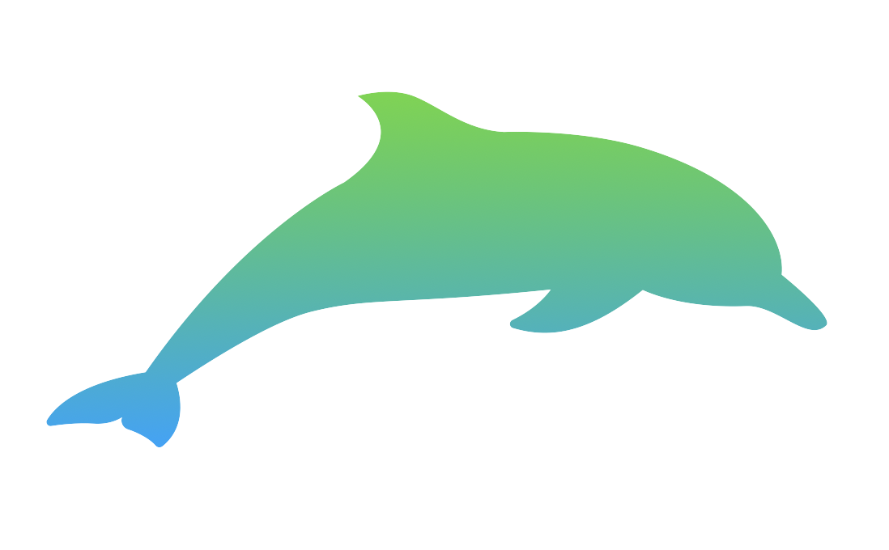
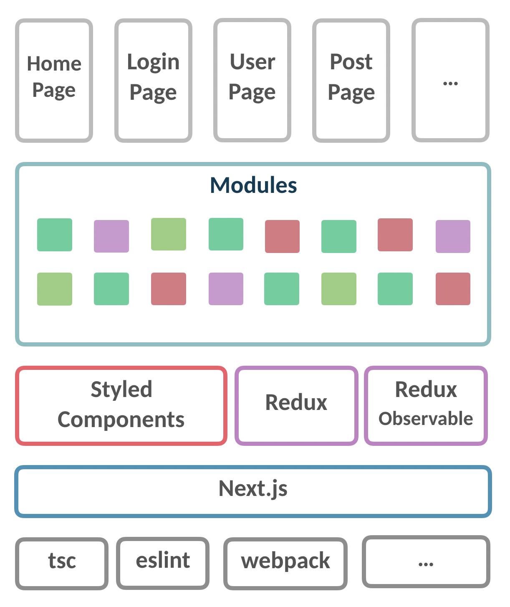

<br />
<p align="center">
  <a href="https://github.com/maxam2017/sync">
    
  </a>
  <h3 align="center">SYNC</h3>
  <p align="center">
    A Collaborative News Platform
    <br />
    <br />
    <a href="http://sync.maxam.now.sh/">View Demo</a>
    ·
    <a href="https://github.com/maxam2017/sync/issues">Report Bug</a>
    ·
    <a href="https://github.com/maxam2017/sync/issues">Request Feature</a>
  </p>
</p>

## Table of Contents

* [About the Project](#about-the-project)
* [Architecture](#architecture)
* [Built With](#built-with)
* [Getting Started](#getting-started)
  * [Prerequisites](#prerequisites)
  * [Installation](#installation)
* [License](#license)

## About The Project
We want to build a man-machine cooperation and collaborative news platform. In recent years, the term fake news has been frequently mentioned, and the authenticity of the information has even affected our lives. Through this integrated news platform, we can provide the public with more accurate and neutral news reports, in order to crack down fake news.
## Architecture
<p align="center">
  
</p>

## Built With
<p align="center">
  
</p>


## Getting Started

### Prerequisites
none

### Installation
1. Clone the repo
    ```sh
    git clone https://github.com/maxam2017/sync.git
    ```
2. Install YARN packages
    ```sh
    yarn
    ```
3. Run dev server
    ```sh
    yarn run dev
    ```
4. Open the browser to `http://localhost:8080`

## License

Distributed under the MIT License. See `LICENSE` for more information.
